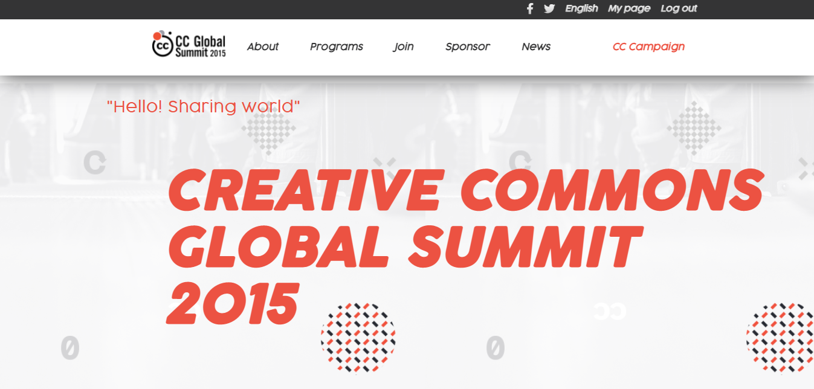

# Capstone_project_html_css_js

> Desktop version + Mobile Version

**This is a capstone project of module 1 (The portal).**

## Built With

- html
- css
- javascript
- linters

## Live Demo

[Click here to see the Portfolio Web](https://micky373.github.io/Capstone_project_html_css_js/)

[Video of the project](https://www.loom.com/share/6db5fb035cae4a2cb818fdfb2d29c808)

## Getting Started

- Add a .gitignore file.
- Set up a linter for HTML,CSS and Javascript. Make sure that any files that are not relevant are ignored by git.
- Add descriptive README file to your project - please use this template but remember to customize it to your project.
- Actually, the webpage has two pages: Home and About pages.
- The speaker section was created dynamically with javascript.
- The mobile version has a hamburger menu for better navigation.

To get a local copy up and running follow these simple example steps.

## Author

Amdebirhan Abebe 

## Materials required for validation

- HTML, CSS and Javascript Linters

## Acknowledgments

- Microverse
- Original design idea by [Cindy Shin in Behance](https://www.behance.net/adagio07)

## Show your support

Give a ⭐️ if you like this project!

